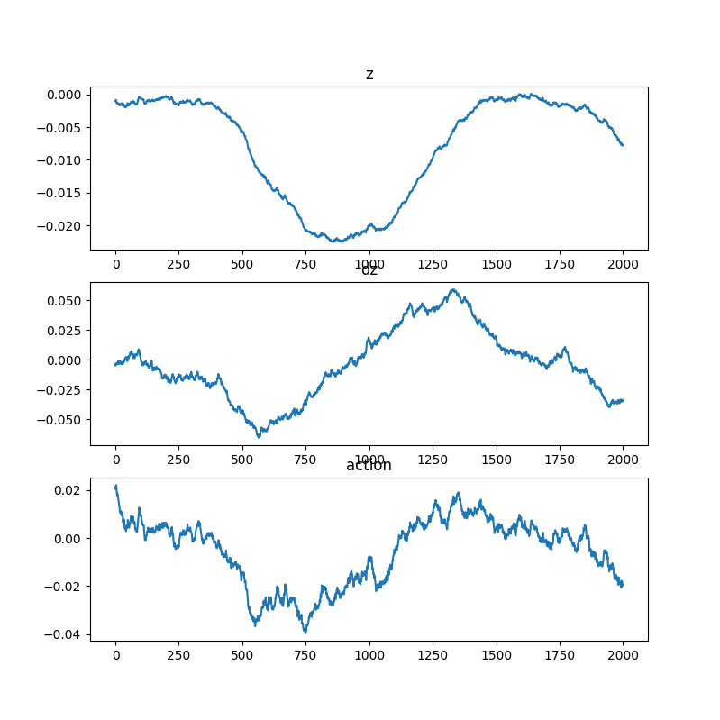

# Tokamak-sim

Tokamak-sim is a reinforcement learning (RL) project that simulates and controls the vertical displacement of plasma in a Tokamak reactor. It uses a custom Gymnasium environment to model the plasma dynamics (including action delays) and trains an agent using **Proximal Policy Optimization (PPO)** backed by a **Mamba State Space Model (SSM)** to handle sequential state data.

## 🚀 Features

- **Custom Physics Environment (`plasma_env.py`)**: A continuous-control `gymnasium` environment simulating a Tokamak's vertical plasma position ($z$), velocity ($dz$), and coil current ($I$). It inherently includes an 8ms control latency (action queue), requiring the agent to plan ahead.
- **Mamba-based PPO Agent (`mamba_ppo.py`)**: Replaces the traditional LSTM/GRU with the modern `mamba_ssm` architecture to process rolling state buffers. This allows the agent to efficiently capture the temporal dependencies caused by delayed voltages.
- **Real-Time Visualization (`visualize.py`)**: A live Matplotlib evaluation script that animates the trained agent's performance across $z$, $dz$, and the applied actions.

## 📁 Project Structure

```text
Tokamak-sim/
│
├── plasma_env.py      # Custom Gymnasium environment for Tokamak physics
├── mamba_ppo.py       # PPO algorithm implementation with Mamba SSM
├── visualize.py       # Real-time inference and plotting script
└── results/
    └── plot.png       # Snapshot of the agent's performance
```

## 🛠️ Installation

Ensure you have Python 3.8+ installed. You will need PyTorch and the Mamba SSM package. 

1. Clone the repository:
   ```bash
   git clone https://github.com/venugopalreddy2004/Tokamak-sim.git
   cd Tokamak-sim
   ```

2. Install the required dependencies:
   ```bash
   pip install torch torchvision torchaudio
   pip install gymnasium numpy matplotlib
   ```

3. Install Mamba (requires a CUDA-compatible GPU for native performance):
   ```bash
   pip install causal-conv1d>=1.2.0
   pip install mamba-ssm
   ```
   *(Note: Mamba installation can be specific to your CUDA version. Refer to the [Mamba GitHub repository](https://github.com/state-spaces/mamba) ).*

## 🧠 Training the Agent

To train the Mamba PPO agent from scratch, run:

```bash
python mamba_ppo.py
```

- This will collect trajectories using a sequence length of 32 past states.
- It computes Generalized Advantage Estimation (GAE) and updates the policy using PPO.
- By default, it runs for 120 iterations and saves the best model as `tokamak_mamba.pth` in the root directory.

## 📊 Visualization & Inference

Once the model is trained (or using the provided `.pth` file), you can visualize the agent's control capability in real-time.

```bash
python visualize.py
```
This script loads `tokamak_mamba.pth`, resets the environment, and runs a 2000-step episode. It pops up a live Matplotlib window updating the graphs for $z$ (position), $dz$ (velocity), and the control voltage action.

## 📈 Results

Because the environment has inherent latency, the agent learns to proactively apply voltage to counteract the natural vertical instability of the simulated plasma.

Below is a snapshot of the trained agent's performance over 2000 steps, showing stable bounded behavior around the equilibrium point:



*Top: Vertical displacement ($z$) | Middle: Vertical velocity ($dz$) | Bottom: Applied control voltage (action)*

## 🔬 Environment Physics Details

- **State Space**: `[z, dz, I]` normalized between `[-1.0, 1.0]`.
- **Action Space**: Continuous `[-1.0, 1.0]` representing the control voltage mapping up to 300V.
- **Latency**: Implemented via an action queue simulating an 8ms hardware delay.
- **Reward Function**: Based on a Lyapunov function $V = z^2 + \lambda_v dz^2$, rewarding the agent for decreasing the system's "energy" while slightly penalizing large control voltages.
